# Sistema Inteligente de Monitoramento Residencial com Arduino e Arquitetura ARM

Projeto acadêmico desenvolvido para a disciplina de Programação de Microprocessadores e Microcontroladores.

---

# 📖 Sobre o Projeto

O projeto consiste no desenvolvimento de um sistema embarcado inteligente capaz de realizar monitoramento residencial automatizado utilizando sensores, Arduino e conceitos introdutórios de arquitetura ARM.

O sistema realiza a leitura contínua da luminosidade do ambiente e da presença de movimento, executando tomadas de decisão automatizadas em tempo real.

Quando o ambiente está escuro e há detecção de movimento, o sistema ativa um alerta visual e sonoro, simulando um mecanismo inteligente de segurança residencial noturna.

📄 [Acessar Artigo Acadêmico em PDF](artigo/artigo-monitoramento-residencial-arduino.pdf)
---

# 🎯 Objetivos

- Desenvolver algoritmos embarcados em linguagem C/C++;
- Aplicar conceitos de automação residencial;
- Utilizar sensores e atuadores em Arduino;
- Simular sistemas embarcados virtualmente;
- Implementar lógica de tomada de decisão automatizada;
- Estudar conceitos introdutórios de arquitetura ARM;
- Desenvolver um sistema de monitoramento inteligente de baixo custo.

---

# ⚙️ Funcionalidades

✅ Monitoramento de luminosidade  
✅ Detecção de movimento  
✅ Acionamento automático de LED  
✅ Alerta sonoro com buzzer  
✅ Interface serial de monitoramento  
✅ Tomada de decisão automatizada  
✅ Simulação virtual do circuito  

---

# 🧠 Lógica do Sistema

O sistema executa a seguinte lógica:

- Ambiente escuro + movimento detectado:
  - LED é acionado;
  - buzzer emite alerta sonoro;
  - mensagem de alerta é exibida no monitor serial.

- Ambiente iluminado + movimento:
  - sistema apenas registra a movimentação no monitor serial.

- Sem movimento:
  - sistema permanece em estado seguro.

---

# 🛠️ Tecnologias Utilizadas

- Arduino UNO
- Linguagem C/C++
- Wokwi Simulator
- GitHub
- Conceitos introdutórios de Arquitetura ARM

---

# 🔌 Componentes Utilizados

| Componente | Função |
|---|---|
| Arduino UNO | Controle principal |
| Sensor LDR | Leitura de luminosidade |
| Sensor PIR | Detecção de movimento |
| LED | Alerta visual |
| Buzzer | Alerta sonoro |

---

# 📷 Estrutura do Projeto

```txt
/projeto
│
├── codigo/
├── imagens/
├── artigo/
├── video/
├── simulacao-arm/
└── README.md
```

---

# 🖼️ Imagens do Projeto

## 🔧 Estrutura Geral do Circuito

Imagem completa do sistema embarcado desenvolvido no simulador Wokwi.

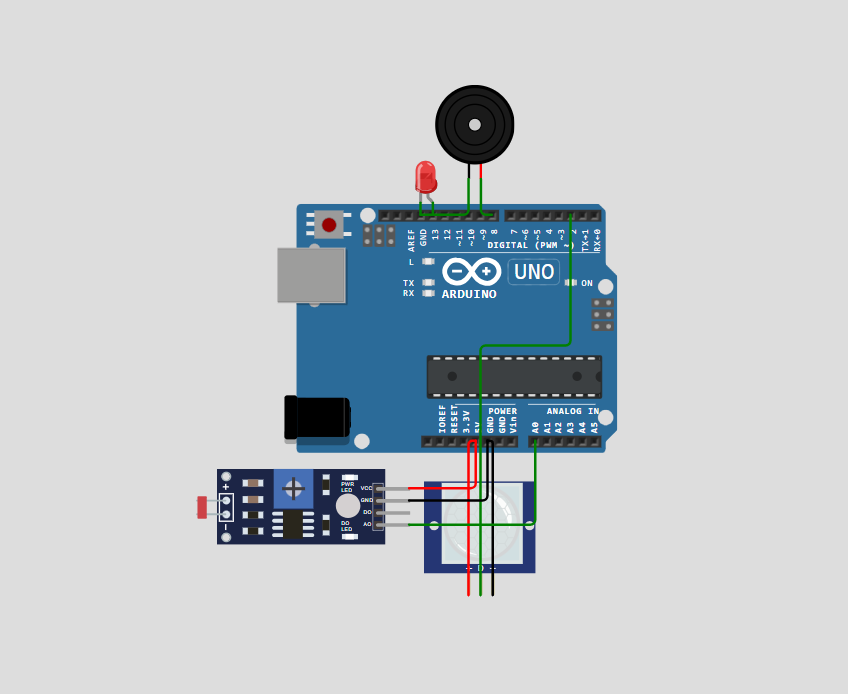

---

# 📡 Sensores e Atuadores

## Sensor LDR — Monitoramento de Luminosidade

Responsável pela leitura da intensidade luminosa do ambiente.

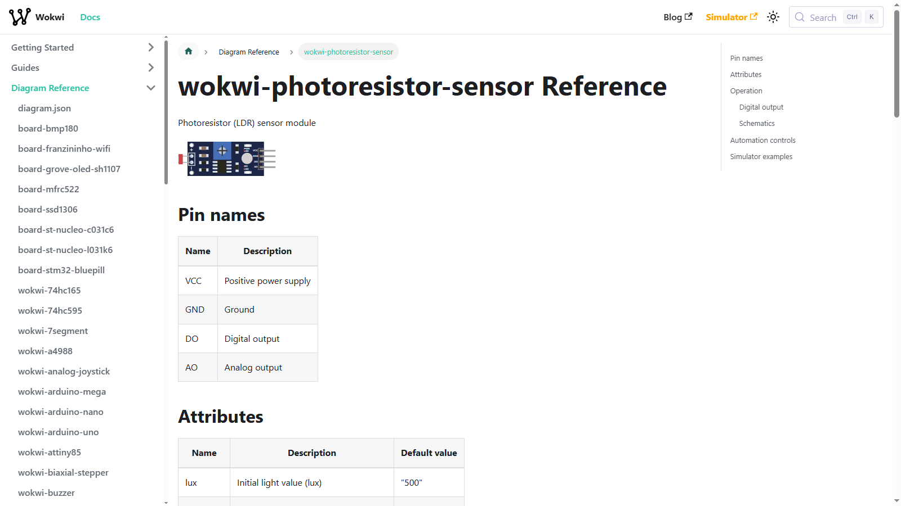

---

## Sensor PIR — Detecção de Movimento

Responsável pela identificação de presença e movimentação.

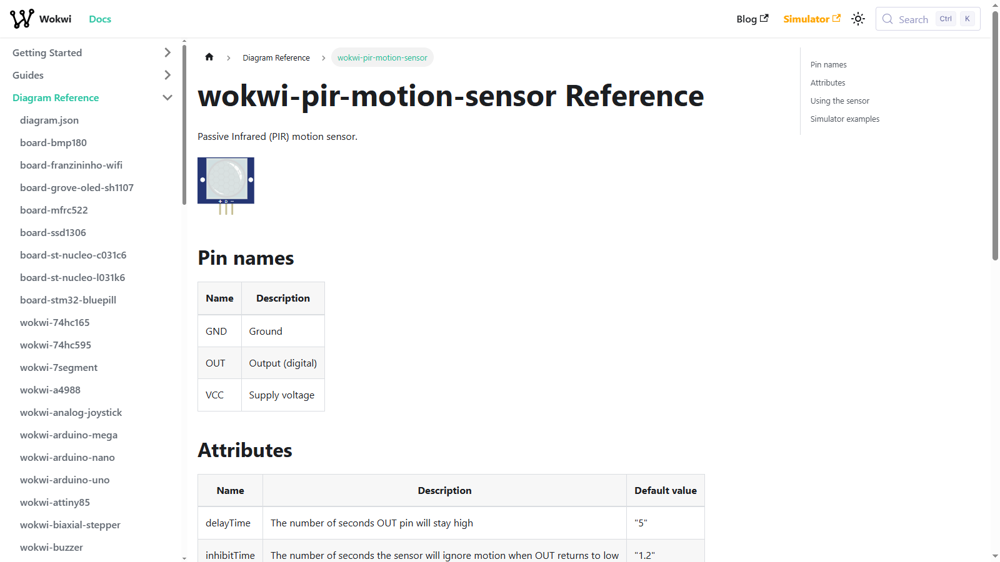

---

## Buzzer — Alerta Sonoro

Utilizado para emissão de alerta sonoro em situações de monitoramento noturno.


---

# 💻 Código-Fonte do Sistema

## Estrutura Principal do Algoritmo

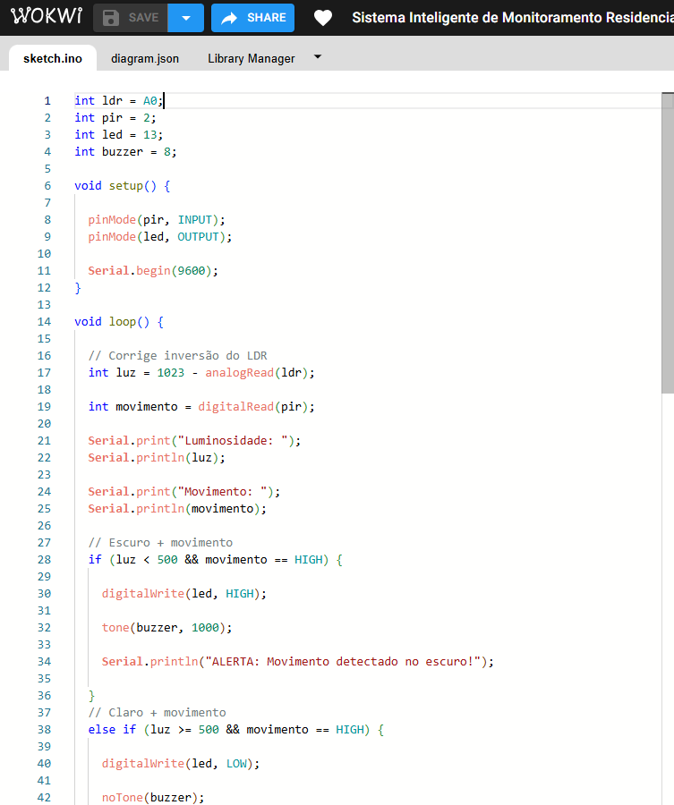

---

## Lógica de Tomada de Decisão

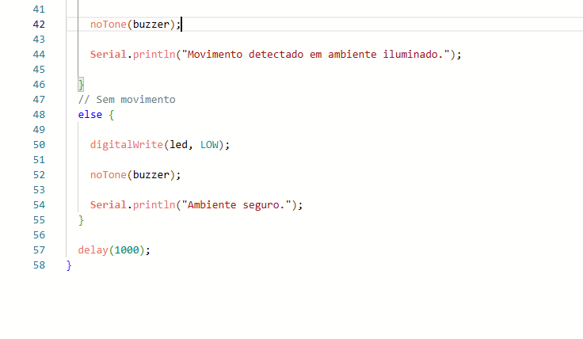

---

# 🧪 Demonstração de Funcionamento

## Ambiente Iluminado com Movimento

O sistema identifica movimentação, porém não ativa alerta sonoro devido à luminosidade do ambiente.

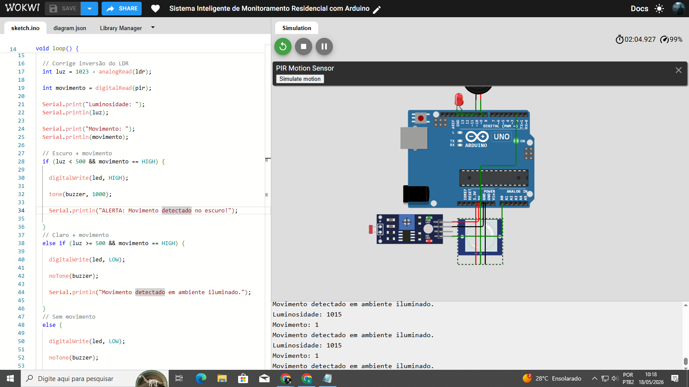

---

## Movimento Detectado em Ambiente Escuro

Quando há baixa luminosidade e movimentação, o sistema ativa os mecanismos de alerta automaticamente.

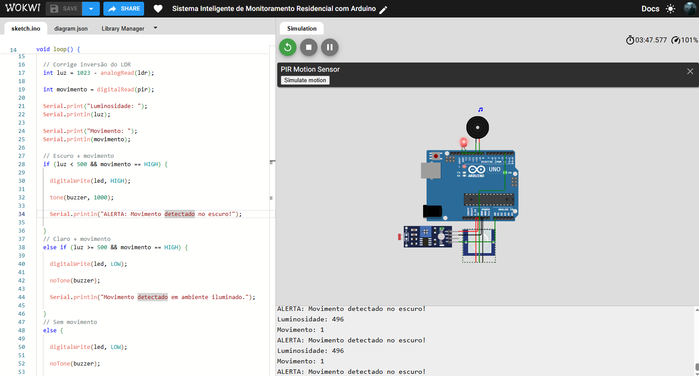

---

## Sistema em Estado Seguro

Situação em que não há movimentação detectada pelo sensor PIR.

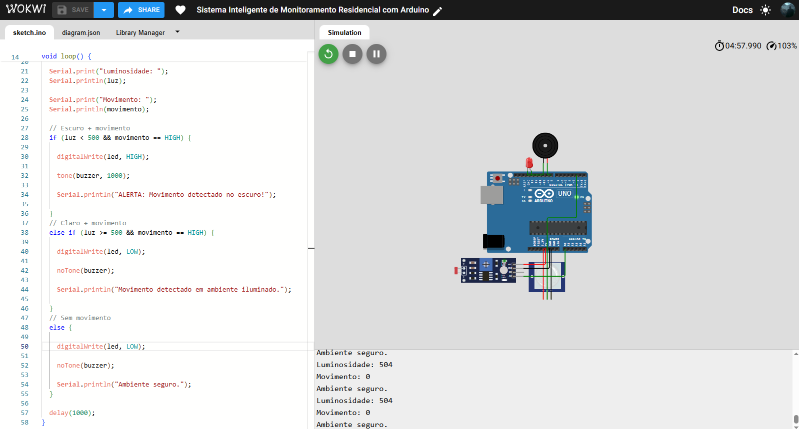

---

## LED e Buzzer Ativados

Demonstração visual do acionamento automático dos atuadores do sistema.

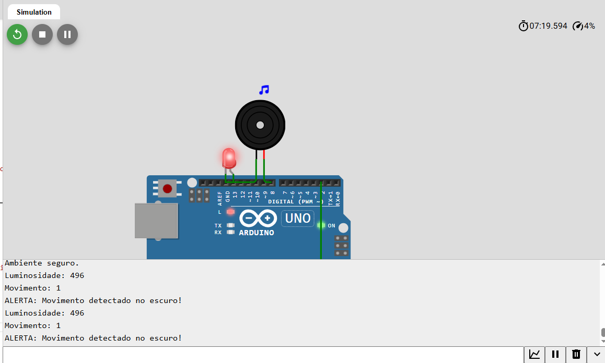

---

# 💻 Código Principal

```cpp
int ldr = A0;
int pir = 2;
int led = 13;
int buzzer = 8;

void setup() {

  pinMode(pir, INPUT);
  pinMode(led, OUTPUT);

  Serial.begin(9600);
}

void loop() {

  int luz = 1023 - analogRead(ldr);

  int movimento = digitalRead(pir);

  Serial.print("Luminosidade: ");
  Serial.println(luz);

  Serial.print("Movimento: ");
  Serial.println(movimento);

  if (luz < 500 && movimento == HIGH) {

    digitalWrite(led, HIGH);

    tone(buzzer, 1000);

    Serial.println("ALERTA: Movimento detectado no escuro!");

  } 
  else if (luz >= 500 && movimento == HIGH) {

    digitalWrite(led, LOW);

    noTone(buzzer);

    Serial.println("Movimento detectado em ambiente iluminado.");

  } 
  else {

    digitalWrite(led, LOW);

    noTone(buzzer);

    Serial.println("Ambiente seguro.");
  }

  delay(1000);
}

```
# 🔄 Diagrama Simplificado do Sistema

LDR → Arduino → LED  
PIR → Arduino → Buzzer

---

# 🧪 Simulação

O projeto foi desenvolvido virtualmente utilizando o simulador Wokwi, permitindo a integração de sensores e atuadores sem necessidade de hardware físico.

---

# 🖥️ Simulação ARM

Além do sistema principal desenvolvido em Arduino UNO, foi realizada uma simulação complementar utilizando Raspberry Pi Pico, plataforma baseada em arquitetura ARM.

A simulação teve como objetivo demonstrar conceitos introdutórios de processamento embarcado, controle de GPIO e execução contínua de algoritmos em sistemas embarcados modernos.

---

## 🔄 Fluxo de Execução do Algoritmo ARM

O processador executa continuamente o seguinte fluxo:

```txt
Inicialização do sistema
        ↓
Configuração do GPIO
        ↓
Acionamento do LED
        ↓
Temporização
        ↓
Desligamento do LED
        ↓
Repetição contínua do algoritmo
```

---

## 🧩 Código da Simulação ARM

```cpp
#include "pico/stdlib.h"

int main() {

    const uint LED = 25;

    gpio_init(LED);
    gpio_set_dir(LED, GPIO_OUT);

    while (true) {

        gpio_put(LED, 1);
        sleep_ms(1000);

        gpio_put(LED, 0);
        sleep_ms(1000);
    }
}
```

---

## 📷 Simulação Raspberry Pi Pico

### Estrutura da Plataforma ARM

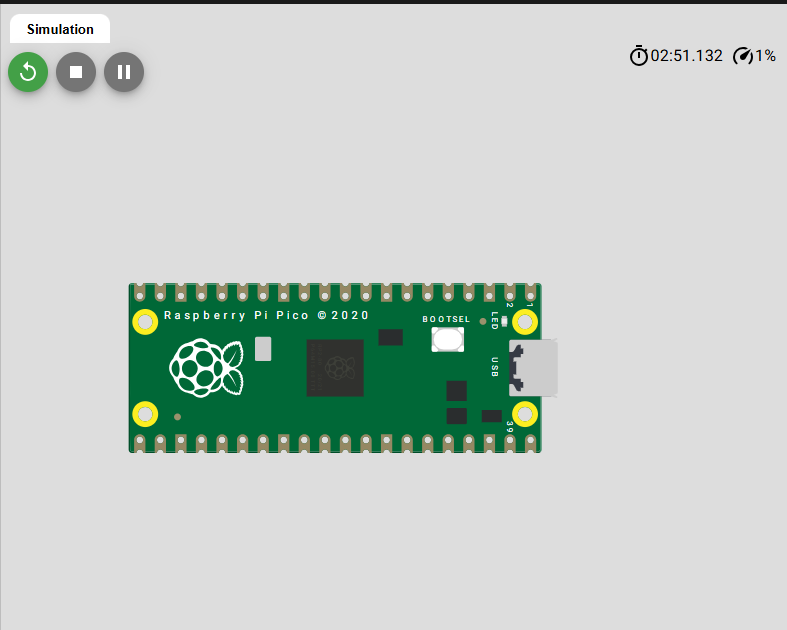

---

### Código Executado na Arquitetura ARM

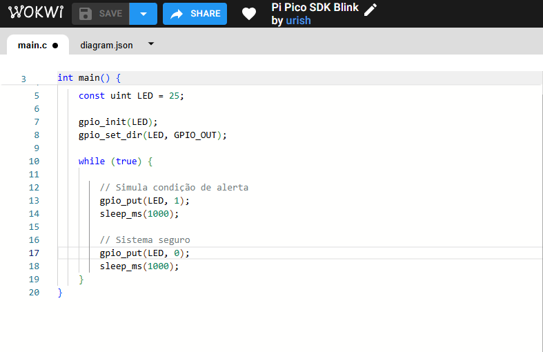

---

### Execução do Algoritmo Embarcado

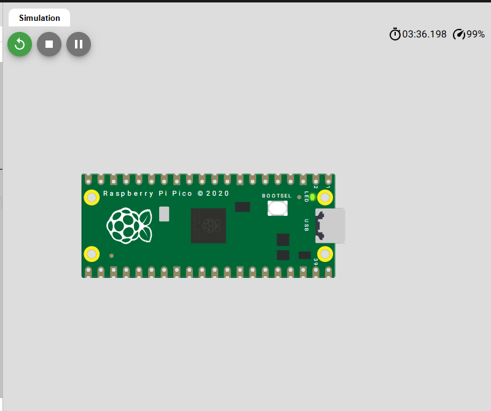

---

# 🧱 Conceitos de Arquitetura ARM

Durante o desenvolvimento do projeto foram estudados conceitos introdutórios de arquitetura ARM, amplamente utilizada em sistemas embarcados modernos devido à sua eficiência energética e capacidade de processamento em tempo real.

A arquitetura ARM foi utilizada como base conceitual para compreensão do funcionamento de sistemas embarcados inteligentes.

---

# 📊 Resultados Obtidos

O sistema apresentou funcionamento satisfatório durante os testes realizados no ambiente de simulação.

Os sensores responderam corretamente às alterações de luminosidade e presença, realizando acionamentos automáticos conforme as condições programadas.

O projeto demonstrou a aplicação prática de:
- programação embarcada;
- automação residencial;
- integração de sensores;
- lógica inteligente;
- monitoramento em tempo real.

---

# 🎥 Demonstração

Adicionar vídeo demonstrando o funcionamento do sistema.

---

# 🔗 Simulação Online

https://wokwi.com/projects/464364096321736705

---

# 👨‍💻 Autor

Kauã Fernandez

Projeto desenvolvido para fins acadêmicos.
